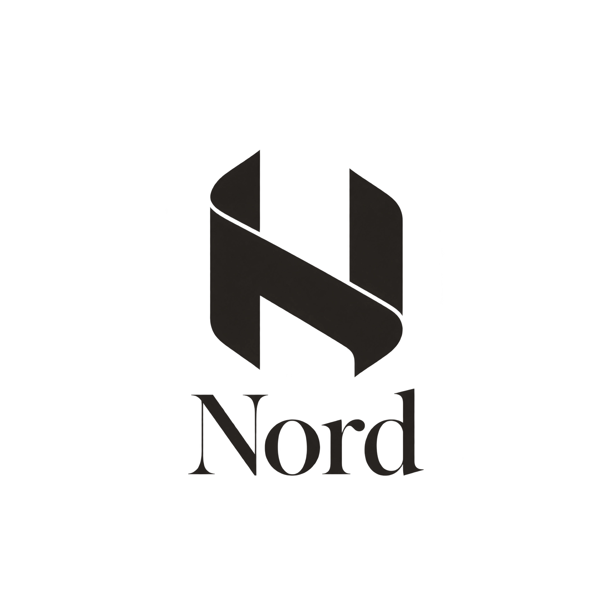
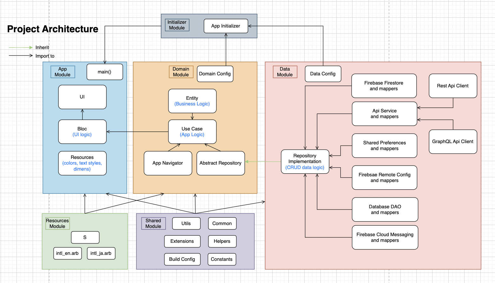
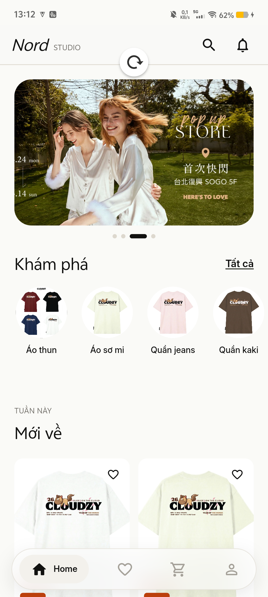
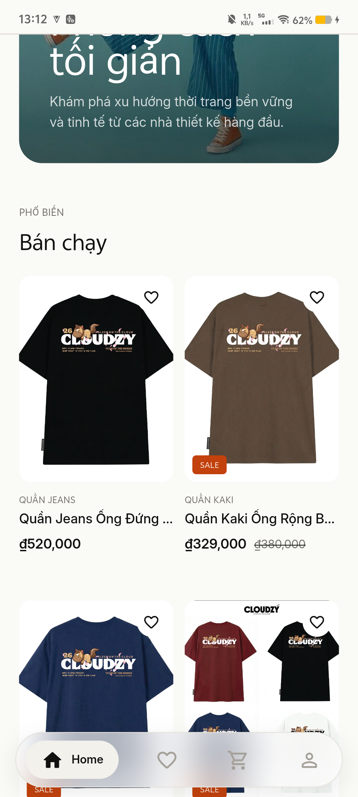
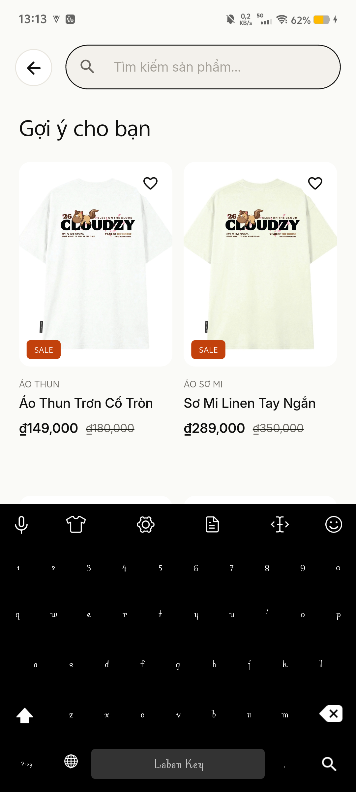
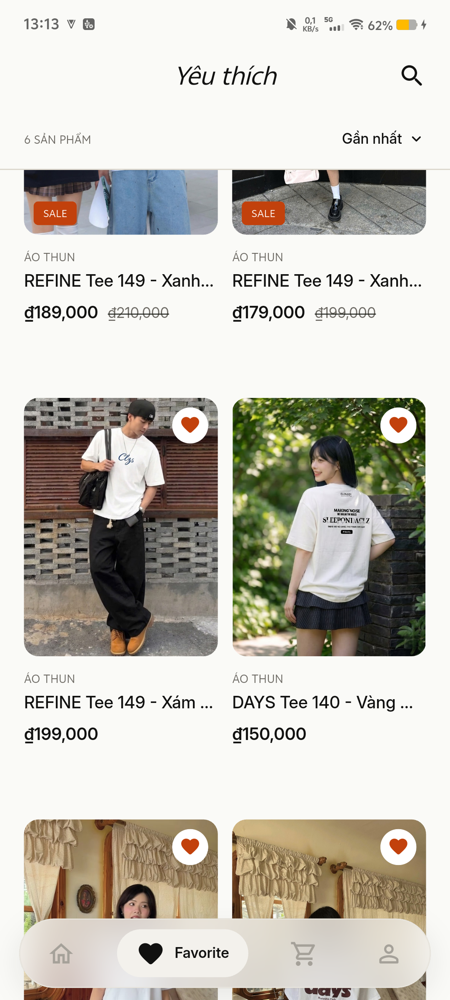
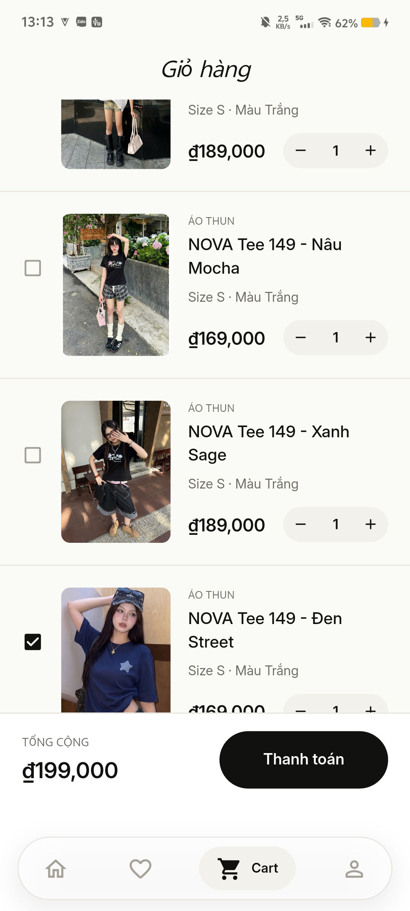
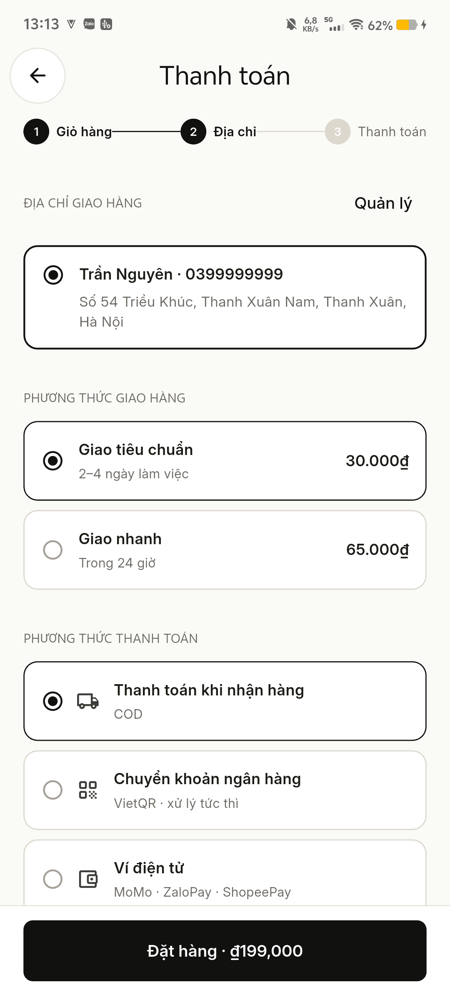
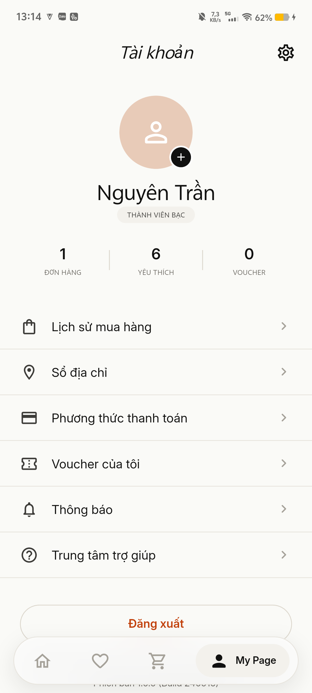

<p align="center">
  
</p>

<h1 align="center">Nord - Fashion App - Clean Architecture</h1>

<p align="center">
  <a href="https://flutter.dev" target="_blank">=3.10.0-%2302569B.svg?style=flat&logo=Flutter&logoColor=white" alt="Flutter"></a>
  <a href="https://dart.dev" target="_blank">=3.9.0-%230175C2.svg?style=flat&logo=dart&logoColor=white" alt="Dart"></a>
  <a href="https://bloclibrary.dev" target="_blank"></a>
  <a href="#license"></a>
</p>

<p align="center"><b>A professional Flutter boilerplate using Clean Architecture, BLoC pattern, and Melos for Monorepo management.</b></p>

---

## 📋 Table of Contents

- [👋 Introduction](#-introduction)
- [✨ Key Features](#-key-features)
- [🛠️ Technologies](#-technologies)
- [📂 Project Structure](#-project-structure)
- [🚀 Quick Setup](#-quick-setup)
- [📖 Clean Architecture Deep Dive](#-architecture-deep-dive)
- [📄 License](#-license)

---

## 👋 Introduction

This project is a high-quality "Base" project designed for scalability and maintainability. It implements **Clean Architecture** to decouple business logic from the UI and data sources, making it easy to test and extend. It is organized as a **Monorepo** using Melos, splitting the application into distinct, reusable packages.

---

## ✨ Key Features

<table>
  <tr>
    <td>🏗️ <b>Clean Architecture</b>: Decoupled layers (App, Domain, Data, Shared).</td>
    <td>🔗 <b>Dependency Injection</b>: Automated setup with GetIt & Injectable.</td>
  </tr>
  <tr>
    <td>🔄 <b>State Management</b>: Robust implementation using flutter_bloc.</td>
    <td>🌐 <b>REST API</b>: Type-safe requests with Dio & Retrofit.</td>
  </tr>
  <tr>
    <td>💾 <b>Local Database</b>: High-performance storage with ObjectBox.</td>
    <td>☁️ <b>Backend</b>: Supabase integration.</td>
  </tr>
  <tr>
    <td>✨ <b>Shimmer Loading</b>: Custom shimmer effect for smooth loading UX.</td>
    <td>🛠️ <b>Custom Lints</b>: Enforced coding standards via nals_lints.</td>
  </tr>
  <tr>
    <td>📱 <b>Responsive UI</b>: Adaptive layouts with flutter_screenutil.</td>
    <td>🌍 <b>Localization</b>: Internationalization support (i18n).</td>
  </tr>
</table>

---

## 🛠️ Technologies

| Core | Navigation & DI | Data & Storage |
|------|-----------------|----------------|
| Flutter SDK (>=3.10.0) | AutoRoute | Dio (HTTP) |
| Dart (>=3.9.0) | GetIt | ObjectBox (DB) |
| Melos (Monorepo) | Injectable | Supabase |
| flutter_bloc | | Freezed (Data Class) |

---

## 📂 Project Structure

The project is structured as a Monorepo to ensure a clear separation of concerns.

<p align="center">
  
</p>

```text
fahion/ (Root)
├── 📦 app/            # Presentation Layer: UI, BLoCs, Navigation, Pages
│   ├── lib/base/      # Core base classes for BLoCs and Pages
│   └── lib/ui/        # Feature-based UI modules (Home, Login, etc.)
│
├── 📦 domain/         # Business Logic Layer: UseCases, Entities, Repository Interfaces
│   └── lib/src/       # Pure Dart code (No Flutter dependencies)
│
├── 📦 data/           # Data Layer: Repository Impl, API Services, Database, Mappers
│   └── lib/src/api/   # HTTP clients and DTO models
│
├── 📦 shared/         # Shared Utilities: Constants, Exceptions, Helper Classes, Utils
│
├── 📦 resources/      # Global Resources: Assets, Fonts, Localization (i18n)
│
├── 📦 initializer/    # App Startup: Orchestrates initialization of all modules
│
├── 🏗️ nals_lints/      # Custom analysis options and lint rules
│
└── 🛠️ tools/          # Build scripts and generator tools
```

---

## 🚀 Quick Setup

### Prerequisites
- Flutter SDK: `3.13.1`
- Melos: `dart pub global activate melos 3.1.0`

### Installation
1. Clone the repository.
2. Initialize the project environment:
   ```bash
   make gen_env
   ```
3. Bootstrap the packages and sync dependencies:
   ```bash
   make sync
   ```
4. Run the application:
   ```bash
   flutter run
   ```

---

## 📖 Clean Architecture Deep Dive

This base focuses on **reusability** through powerful base classes:

- **`BaseBloc`**: Handles loading states automatically via `CommonBloc`, provides `runBlocCatching` for unified error handling.
- **`BaseUseCase`**: Standardizes how business logic is executed with built-in logging and error mapping.
- **`CommonBloc`**: A global state manager for app-wide events like showing a loading overlay or handling session expiration.
- **`runBlocCatching`**: A robust wrapper that handles `showLoading`, `hideLoading`, `try-catch`, and `automatic retry` logic.


---

## 📱 Screenshots

<details>
  <summary>🏠 Home & Search</summary>
  <p align="center">
    
    
    
  </p>
</details>

<details>
  <summary>❤️ Favorite</summary>
  <p align="center">
    
  </p>
</details>

<details>
  <summary>🛒 Cart & Checkout</summary>
  <p align="center">
    
    
  </p>
</details>

<details>
  <summary>👤 My Page</summary>
  <p align="center">
    
  </p>
</details>

---

## 📄 License

MIT License © 2024
